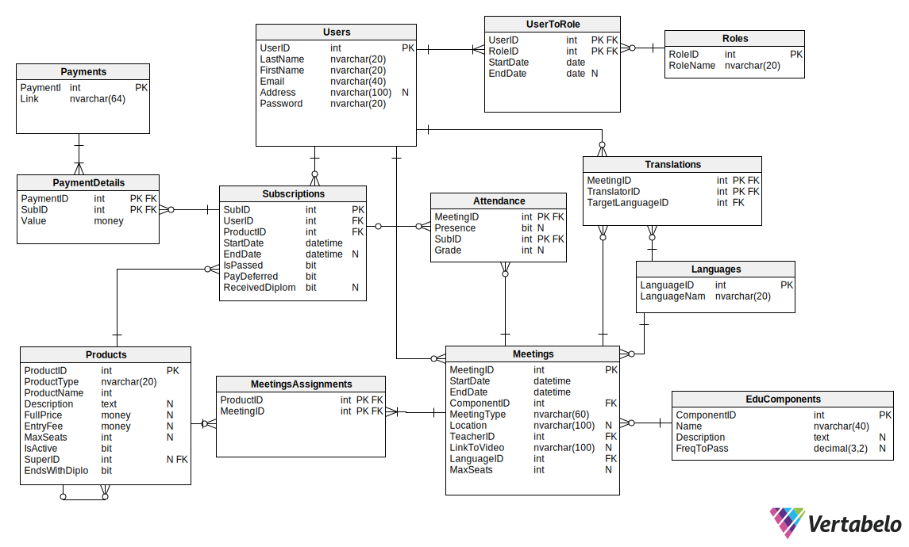

---
# Podstawy baz danych

grupa: 13

dzień i godz zajęć: środa 13:15

nr zespołu: 5

**Autorzy:** Karolina Nitsch, Witold Nieć

https://github.com/kanitsch/bazy_danych


--- 

# 1.	Wymagania i funkcje systemu
Projektowany system bazodanowy ma posłużyć firmie  oferującej różnego rodzaju kursy i szkolenia w modelu hybrydowym. Usługi dzielą się na: 
- Webinary
- Kursy
- Studia
- Pojedyncze spotkania studyjne
  
Składają się z następujących jednostek szkoleniowych:
  - spotkania online asynchroniczne (kursy, studia) 
  - spotkania online synchroniczne  (webinary, kursy, studia)
  - spotkania stacjonarne (kursy, studia)
  - praktyki (studia)
  
W systemie wyróżniamy następujące role:
- Użytkownik niezalogowany
- Klient 
- Nauczyciel
- Administrator
- Dyrektor
- Księgowy
  
Użytkownicy mogą korzystać z różnych funkcji, w zależności od ich ról w systemie. Role mogą być dziedziczone.

## Funkcje


### Funkcje systemu
- Zarządzanie dostepami do obszarów funkcjonalnych w oparciu o role w systemie
- Przyznawanie i odbieranie dostępu do jednostek szkoleniowych na podstawie wykupionych usług i terminów ważności. 

- Zarzadzanie dostępnością usług na podstawie limitów miejsc
- Zarządzanie zaliczeniami jednostek szkoleniowych i produktów według zasad:
    - Studia - 80% frekwencji
    - Praktyki - 100% frekwencji
    - Kursy - zaliczenie 80% modułów
- Rejestrowanie i odnotowywanie obecności wszystkich uczestników spotkań online (z podziałem na role)
- Generowanie linków do płatności
- Rejestrownie płatności
 
### Użytkownik niezalogowany
- Przegladanie, wyszukiwanie dostępnych produktów (z informacją o ich termianch, dostepnosci cenach): 
  - Webinarów, 
  - Kursów (wraz z programem), 
  - Studiów (wraz sylabusem) 
  - Zajeć studyjnych - dostępnych bez konieczności uczestnictwa w całych studiach
- Dostęp do ogólnych informacji na temat zasad funkcjonowania szkoły, regulaminów, formularzy komunikacyjnych
  
### Klient (użytkownik zalogowany)

Dziedziczy funkcje Użytkownika niezalogowanego.

#### Ogólne 
- możliwość zgłaszania problemów technicznych do administratora

#### Zakupy i zarządzanie dostępnymi szkoleniami
- Wyświetlanie liczby zapisanych osób, dostepnych tłumaczeniach i limicie miejsc dla danego produktu
- Dokonywanie zapisów poprzez koszyk zakupowy
- Generowanie żądania linków do płatności 
  - płatność pełna za webinar - link ważny do momentu rozpoczecia webinaru
  - płatność pełna za zajecia studyjne - link ważny do 3 dni przed rozpoczeciem kursu
  - płatość pełna za kurs - link ważny do 3 dni przed rozpoczeciem kursu
  - płatność wpisowego za studia - link ważny w dniu zapisu
  - płatność za zjazd w ramach studiów - link ważny do 3 dni przed rozpoczeciem zjazdu
  - dla każdej płatnosci istnieje możliwość zawnioskowania o płatność odroczona (wymaga akceptacji Dyrektora)
- Integracja z operatorem płatności
<!-- - Rejestrownie płatności za produkty -->

- Wyświetlanie aktualnej listy zamówionych usług szkoleniowych

- Sprawdzanie kolizji


#### Webinary
- Wyswietlenie dostępnych webinarów z informacją o terminach
- Odtwarzanie darmowych webinarów 
- Odtwarzanie płatnych webinarów z wykupionym dostępem i w terminie dostępności

#### Kursy
- Wyświetlenie wykupionych kursów ze statusem zaawansowania
- Wyświetlenie zawartości kursów z informacją o terminach 
- Uruchamianie spotkan online asynchronicznych
- Dołączanie do spotkań online synchronicznych
- Sprawdzanie statusu obecności/zaliczenia 
- Oglądanie nagrań ze spotkań online


#### Studia
- Wyświetlenie wykupionych studiów ze statusem zaawansowania
- Wyświetlenie sylabusu studiów z informacją o terminach
- Uruchamianie spotkań online asynchronicznych
- Dołączanie do spotkań online synchronicznych
- Sprawdzanie statusu obecności/zaliczenia
- Oglądanie nagrań ze spotkań online
- Odrabianie nieobecności

  


### Nauczyciel

#### Ogólne

- Wyświetlanie kalendarza/planu zajęć
- Dołączanie do spotkań online (z odpowiednimi uprawnieniami zarządzania spotkaniem)

#### Spotkania online asynchroniczne 
- Nagrywanie spotkania i udostepnianie nagrań
<!-- - Rejestracja obecności -automatyczna -->


#### Spotkania online synchroniczne
- Nagrywanie spotkania i udostepnianie nagrań
<!-- - Rejestracja obecności -automatyczna -->


#### Spotkania stacjonarne, Praktyki
- Rejestracja obecności uczestników


### Administrator

- Wyświetlanie listy zgłoszonych problemów i możliwość odpowiadania klientom
- Dostęp do szczegółowych informacji o wszystkich użytkownikach systemu
- Dodawanie, usuwanie, modyfikowanie jednostek szkoleniowych i form kształcenia
- Dodawanie i usuwanie użytkowników (Nauczyciel, Dyrektor, Księgowy)
- Zarządzanie rolami
- "awaryjne" zarzadzanie uprawnieniami i kontami Klientów
  
### Księgowy
- Raporty finansowe – zestawienie przychodów dla każdego webinaru/kursu/studium. 
- Raport Lista „dłużników” – osoby, które skorzystały z usług, ale nie uiściły opłat. 

### Dyrektor

  Dziedziczy funkcje księgowego. Ponadto posiada dostęp do następujących funkcji:

- zarządzanie zgodami na płatność odroczoną
- zarządznie dyplomami - wydruki oraz rejestracja wydania dyplomu
- Ogólny raport dotyczący liczby zapisanych osób na przyszłe wydarzenia (z informacją, czy wydarzenie jest stacjonarnie, czy zdalnie). 
- Ogólny raport dotyczący frekwencji na zakończonych już wydarzeniach. 
- Lista obecności dla każdego szkolenia z datą, imieniem, nazwiskiem i informacją czy uczestnik był obecny, czy nie. 
- Raport bilokacji: lista osób, które są zapisane na co najmniej dwa przyszłe szkolenia, które ze sobą kolidują czasowo. 
- Dostęp do informacji o świadczonych usługach
- Dostęp do szczegółowych informacji o wszystkich użytkownikach systemu




# Opis schematu

## Tabele:

**1. Users**
W tabeli users znajują się informacje o wszystkich użytkownikach systemu.
Pola:
- UserID (PK) - unikalne ID użytkownika systemu
- LastName - Nazwisko użytkownika
- FirstName - Imię użytkownika
- Email - email, używany do logowania do systemu
- Address - adres użytkownika
- Password - hasło, używane do logowania do systemu
``` SQL
    CREATE TABLE Users (
        UserID INT PRIMARY KEY,
        LastName NVARCHAR(20) NOT NULL,
        FirstName NVARCHAR(20) NOT NULL,
        Email NVARCHAR(40),
        Address NVARCHAR(100) NOT NULL,
        Password NVARCHAR(20) NOT NULL
    );
```
**2. Roles**
Tablica Roles zawiera informacje o rolach w systemie
Pola:
- RoleID (PK) - ID unikalne dla każdej roli 
- RoleName - nazwa roli w postaci napisu
``` SQL
CREATE TABLE Roles (
    RoleID INT PRIMARY KEY,
    RoleName NVARCHAR(20) NOT NULL  
);
```
**3. UserToRole**
Tabela UserToRole pełnii funkcje tabeli pośredniej, łączącej tabele Users i Roles. Dzięki tej tabeli realizujemy relację wiele do wiele tzn. jeden użytkownik może mieć wiele ról i wielu użytkowników może mieć tą samą rolę. 
Pola:
- UserID (FK) - ID użytkownika
- RoleID (FK) - ID roli
- StartDate - data rozpoczęcia pełnienia danej roli
- EndDate - data zakończenia pełnienia danej roli

``` SQL
CREATE TABLE UserToRole (
    UserID INT NOT NULL,
    RoleID INT NOT NULL,
    StartDate DATE,
    EndDate DATE,
    PRIMARY KEY (UserID, RoleID),
    FOREIGN KEY (UserID) REFERENCES Users(UserID),
    FOREIGN KEY (RoleID) REFERENCES Roles(RoleID)
);
```

**4. Subscriptions**
Zawiera informacje o wykupionych dostępach do produktów. 
Pola:
- SubID (PK) - unikalne ID danej subskrypcji
- UserID (FK) - ID użytkownika
- ProductID (FK) - ID produktu
- StartDate - data przyznania dostępu do produktu
- EndDate - data zabrania dostępu do produktu
- IsPassed - stan zaliczenia danego produktu (jeżeli nie dotyczny null)
- PayDeffered - możliwość płatności odroczonej 
- RecivedDiploma - stan odebrania dyplomu

<!-- 5. Products
Zawiera informacje o produktach oferowanych przez firmę. Produkty to webinary, studia, kursy, moduły, spotkania studyjne, praktyki.
Pola:
 -->
``` SQL
CREATE TABLE Subscriptions (
    SubID INT PRIMARY KEY,
    UserID INT NOT NULL,
    ProductID INT NOT NULL,
    StartDate DATETIME,
    EndDate DATETIME,
    IsPassed BIT,
    PayDeferred BIT,
    ReceivedDiploma BIT,
    FOREIGN KEY (UserID) REFERENCES Users(UserID),
    FOREIGN KEY (ProductID) REFERENCES Products(ProductID)
);

```


**5. Products**

Zawiera informacje o produktach oferowanych przez firmę. Produkty mogą obejmować webinary, studia, kursy, zjazdy, spotkania studyjne i praktyki.
Pola:

- ProductID (PK) - unikalne ID produktu.
- ProductType - typ produktu (np. kurs, webinar).
- ProductName - nazwa produktu.
- Description - szczegółowy opis produktu.
- FullPrice - pełna cena produktu.
- EntryFee - opłata wstępna (jeśli obowiązuje).
- MaxSeats - maksymalna liczba miejsc dostępnych dla danego produktu.
- IsActive - informacja, czy produkt jest aktywny (bit).
- SuperID (FK) - ID nadrzędnego produktu (np. zjazd jest częścią studiów).
- EndsWithDiploma - określenie, czy ukończenie produktu kończy się dyplomem (bit).
``` SQL
CREATE TABLE Products (
    ProductID INT PRIMARY KEY,
    ProductType NVARCHAR(20),
    ProductName NVARCHAR(20),
    Description TEXT,
    FullPrice MONEY,
    EntryFee MONEY,
    MaxSeats INT,
    IsActive BIT,
    SuperID INT,
    EndsWithDiploma BIT,
    FOREIGN KEY (SuperID) REFERENCES Products(ProductID)
);
```

**6. Payments**

Zawiera dane dotyczące płatności realizowanych w systemie.
Pola:

- PaymentID (PK) - unikalne ID płatności.
- Link - odnośnik do potwierdzenia płatności (np. URL faktury).
``` SQL
CREATE TABLE Payments (
    PaymentID INT PRIMARY KEY,
    Link NVARCHAR(84)
);
```

**7. PaymentDetails**

Łączy płatności z subskrypcjami, przechowując szczegóły dotyczące wartości płatności.
Pola:

- PaymentID (FK) - ID płatności.
- SubID (FK) - ID subskrypcji, której dotyczy płatność.
- Value - kwota płatności.
``` SQL
CREATE TABLE PaymentDetails (
    PaymentID INT NOT NULL,
    SubID INT NOT NULL,
    Value MONEY,
    PRIMARY KEY (PaymentID, SubID),
    FOREIGN KEY (PaymentID) REFERENCES Payments(PaymentID),
    FOREIGN KEY (SubID) REFERENCES Subscriptions(SubID)
);

```

**8. Meetings**

Zawiera informacje o spotkaniach (np. wykładach, zajęciach, egzaminach).
Pola:

- MeetingID (PK) - unikalne ID spotkania.
- StartDate - data rozpoczęcia spotkania.
- EndDate - data zakończenia spotkania.
- ComponentID (FK) - ID komponentu edukacyjnego, do którego należy spotkanie.
- Location - miejsce, w którym odbywa się spotkanie.
- MeetingType - typ spotkania (np. online, stacjonarne).
- LinkToVideo - odnośnik do nagrania spotkania (jeśli istnieje).
- TeacherID (FK) - ID nauczyciela prowadzącego spotkanie.
- LanguageID (FK) - język, w jakim odbywa się spotkanie.
- MaxSeats - maksymalna liczba uczestników.
``` SQL
CREATE TABLE Meetings (
    MeetingID INT PRIMARY KEY,
    StartDate DATETIME,
    EndDate DATETIME,
    ComponentID INT,
    MeetingType NVARCHAR(80),
    Location NVARCHAR(100),
    TeacherID INT,
    LinkToVideo NVARCHAR(100),
    LanguageID INT,
    MaxSeats INT,
    FOREIGN KEY (ComponentID) REFERENCES EduComponents(ComponentID),
    FOREIGN KEY (LanguageID) REFERENCES Languages(LanguageID)
);
```

**9. MeetingsAssignments**

Łączy spotkania z produktami, do których należą.
Pola:

- ProductID (FK) - ID produktu.
- MeetingID (FK) - ID spotkania.
``` SQL
CREATE TABLE MeetingsAssignments (
    ProductID INT NOT NULL,
    MeetingID INT NOT NULL,
    PRIMARY KEY (ProductID, MeetingID),
    FOREIGN KEY (ProductID) REFERENCES Products(ProductID),
    FOREIGN KEY (MeetingID) REFERENCES Meetings(MeetingID)
);
```

**10. Attendance**

Zawiera informacje o obecności użytkowników na spotkaniach.
Pola:

- MeetingID (FK) - ID spotkania.
- SubID (FK) - ID subskrypcji użytkownika.
- Presence - informacja o obecności użytkownika na spotkaniu (bit).
- Grade - ocena uzyskana na spotkaniu (jeśli dotyczy).
``` SQL
CREATE TABLE Attendance (
    MeetingID INT NOT NULL,
    SubID INT NOT NULL,
    Presence BIT,
    Grade INT,
    PRIMARY KEY (MeetingID, SubID),
    FOREIGN KEY (MeetingID) REFERENCES Meetings(MeetingID),
    FOREIGN KEY (SubID) REFERENCES Subscriptions(SubID)
);
```

**11. EduComponents**

Zawiera dane o komponentach edukacyjnych, które są częścią produktów.
Pola:

- ComponentID (PK) - unikalne ID komponentu edukacyjnego.
- Name - nazwa komponentu edukacyjnego.
- Description - szczegółowy opis komponentu.
- FreqToPass - wymagane minimum zaliczeń (np. liczba spotkań do zaliczenia).
``` SQL
CREATE TABLE EduComponents (
    ComponentID INT PRIMARY KEY,
    Name NVARCHAR(40),
    Description TEXT,
    FreqToPass DECIMAL(3, 2)
);
```

**12. Languages**

Przechowuje listę dostępnych języków w systemie.
Pola:

- LanguageID (PK) - unikalne ID języka.
- LanguageName - nazwa języka (np. angielski, polski).
``` SQL
CREATE TABLE Languages (
    LanguageID INT PRIMARY KEY,
    LanguageName NVARCHAR(20)
);
```

**13. Translations**

Przechowuje informacje o tłumaczeniach wykonanych dla spotkań.
Pola:

- MeetingID (FK) - ID spotkania, które było tłumaczone.
- TranslatorID (FK) - ID tłumacza.
- TargetLanguageID (FK) - ID języka docelowego tłumaczenia.
``` SQL
CREATE TABLE Translations (
    MeetingID INT NOT NULL,
    TranslatorID INT NOT NULL,
    TargetLanguageID INT NOT NULL,
    PRIMARY KEY (MeetingID, TranslatorID, TargetLanguageID),
    FOREIGN KEY (MeetingID) REFERENCES Meetings(MeetingID),
    FOREIGN KEY (TranslatorID) REFERENCES Users(UserID),
    FOREIGN KEY (TargetLanguageID) REFERENCES Languages(LanguageID)
);
```


Dane testowe:
<small><small><small><small>
### Users 
| UserID | LastName   | FirstName | Email                   | Address            | Password     |
|--------|------------|-----------|-------------------------|--------------------|--------------|
| 1      | Smith      | John      | john.smith@example.com  | 123 Main St, NY    | password123  |
| 2      | Doe        | Jane      | jane.doe@example.com    | 456 Elm St, LA     | securePass!  |
| 3      | Kowalski   | Jan       | jan.kowalski@example.pl | 789 Oak St, Warsaw | kowalski#21  |

---

### Roles 
| RoleID | RoleName    |
|--------|-------------|
| 1      | Client      |
| 2      | Academic    |
| 3      | Translator  |

---

### Products 
| ProductID | ProductType | ProductName            | Description                            | FullPrice | EntryFee | MaxSeats | IsActive | EndsWithDiploma |
|-----------|-------------|------------------------|----------------------------------------|-----------|----------|----------|----------|-----------------|
| 101       | Webinar     | Intro to SQL          | Basics of SQL for beginners.           | 50.00     | NULL     | 100      | 1        | 0               |
| 102       | Course      | Advanced Python       | Data structures and algorithms in Python. | 500.00    | 100.00  | 30       | 1        | 1               |
| 103       | Study       | Master in Data Science| Comprehensive 2-year program.          | 10000.00  | 500.00  | 20       | 1        | 1               |

---


### Subscriptions 
| SubID | UserID | ProductID | StartDate   | EndDate     | IsPassed | PayDeferred | ReceivedDiploma |
|-------|--------|-----------|-------------|-------------|----------|-------------|-----------------|
| 1     | 1      | 101       | 2023-01-01  | 2023-02-01  | NULL     | 0           | 0               |
| 2     | 2      | 102       | 2023-01-15  | 2023-03-15  | NULL     | 1           | 0               |
| 3     | 3      | 103       | 2023-02-01  | 2025-01-31  | 0        | 0           | 0               |

---

### Attendance 
| MeetingID | SubID | Presence | Grade |
|-----------|-------|----------|-------|
| 1         | 1     | 1        | NULL  |
| 2         | 2     | 0        | NULL  |
| 3         | 3     | 1        | 85    |

---

### Payments 
| PaymentID | Link                     |
|-----------|--------------------------|
| 1         | https://payment.link/1   |
| 2         | https://payment.link/2   |

---

### PaymentDetails 
| PaymentID | SubID | Value  |
|-----------|-------|--------|
| 1         | 1     | 50.00 |
| 2         | 2     | 500.00 |


