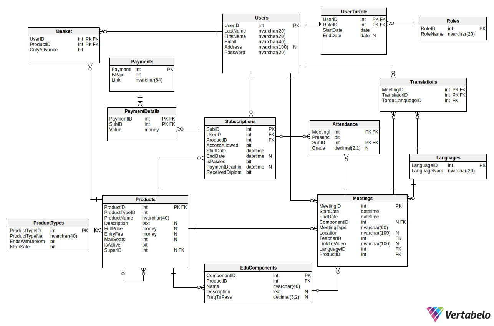

---
# Podstawy baz danych

grupa: 13

dzień i godz zajęć: środa 13:15

nr zespołu: 5

**Autorzy:** Karolina Nitsch, Witold Nieć

https://github.com/kanitsch/bazy_danych


--- 

# 1.	Wymagania i funkcje systemu
Projektowany system bazodanowy ma posłużyć firmie  oferującej różnego rodzaju kursy i szkolenia w modelu hybrydowym. Usługi dzielą się na: 
- Webinary
- Kursy
- Studia
- Pojedyncze spotkania studyjne
  
Składają się z następujących jednostek szkoleniowych:
  - spotkania online asynchroniczne (kursy, studia) 
  - spotkania online synchroniczne  (webinary, kursy, studia)
  - spotkania stacjonarne (kursy, studia)
  - praktyki (studia)
  - egzaminy (studia)
  
W systemie wyróżniamy następujące role:
- Użytkownik niezalogowany
- Klient 
- Nauczyciel
- Administrator
- Dyrektor
- Księgowy
  
Użytkownicy mogą korzystać z różnych funkcji, w zależności od ich ról w systemie. Role mogą być dziedziczone.

## Funkcje


### Funkcje systemu
- Zarządzanie dostepami do obszarów funkcjonalnych w oparciu o role w systemie
- Przyznawanie i odbieranie dostępu do jednostek szkoleniowych na podstawie wykupionych usług i terminów ważności. 

- Zarzadzanie dostępnością usług na podstawie limitów miejsc
- Zarządzanie zaliczeniami jednostek szkoleniowych i produktów według zasad:
    - Studia - 80% frekwencji
    - Praktyki - 100% frekwencji
    - Kursy - zaliczenie 80% modułów
- Rejestrowanie i odnotowywanie obecności wszystkich uczestników spotkań online (z podziałem na role)
- Generowanie linków do płatności
- Rejestrownie płatności
 
### Użytkownik niezalogowany
- Przegladanie, wyszukiwanie dostępnych produktów (z informacją o ich termianch, dostepnosci cenach): 
  - Webinarów, 
  - Kursów (wraz z programem), 
  - Studiów (wraz sylabusem) 
  - Zajeć studyjnych - dostępnych bez konieczności uczestnictwa w całych studiach
- Dostęp do ogólnych informacji na temat zasad funkcjonowania szkoły, regulaminów, formularzy komunikacyjnych
  
### Klient (użytkownik zalogowany)

Dziedziczy funkcje Użytkownika niezalogowanego.

#### Ogólne 
- możliwość zgłaszania problemów technicznych do administratora

#### Zakupy i zarządzanie dostępnymi szkoleniami
- Wyświetlanie liczby zapisanych osób, dostepnych tłumaczeniach i limicie miejsc dla danego produktu
- Dokonywanie zapisów poprzez koszyk zakupowy
- Generowanie żądania linków do płatności 
  - płatność pełna za webinar - link ważny do momentu rozpoczecia webinaru
  - płatność pełna za zajecia studyjne - link ważny do 3 dni przed rozpoczeciem kursu
  - płatość pełna za kurs - link ważny do 3 dni przed rozpoczeciem kursu
  - płatność wpisowego za studia - link ważny w dniu zapisu
  - płatność za zjazd w ramach studiów - link ważny do 3 dni przed rozpoczeciem zjazdu
  - dla każdej płatnosci istnieje możliwość zawnioskowania o płatność odroczona (wymaga akceptacji Dyrektora)
- Integracja z operatorem płatności
<!-- - Rejestrownie płatności za produkty -->

- Wyświetlanie aktualnej listy zamówionych usług szkoleniowych

- Sprawdzanie kolizji


#### Webinary
- Wyswietlenie dostępnych webinarów z informacją o terminach
- Odtwarzanie darmowych webinarów 
- Odtwarzanie płatnych webinarów z wykupionym dostępem i w terminie dostępności

#### Kursy
- Wyświetlenie wykupionych kursów ze statusem zaawansowania
- Wyświetlenie zawartości kursów z informacją o terminach 
- Uruchamianie spotkan online asynchronicznych
- Dołączanie do spotkań online synchronicznych
- Sprawdzanie statusu obecności/zaliczenia 
- Oglądanie nagrań ze spotkań online


#### Studia
- Wyświetlenie wykupionych studiów ze statusem zaawansowania
- Wyświetlenie sylabusu studiów z informacją o terminach
- Uruchamianie spotkań online asynchronicznych
- Dołączanie do spotkań online synchronicznych
- Sprawdzanie statusu obecności/zaliczenia
- Oglądanie nagrań ze spotkań online
- Odrabianie nieobecności

  


### Nauczyciel

#### Ogólne

- Wyświetlanie kalendarza/planu zajęć
- Dołączanie do spotkań online (z odpowiednimi uprawnieniami zarządzania spotkaniem)

#### Spotkania online asynchroniczne 
- Nagrywanie spotkania i udostepnianie nagrań
<!-- - Rejestracja obecności -automatyczna -->


#### Spotkania online synchroniczne
- Nagrywanie spotkania i udostepnianie nagrań
<!-- - Rejestracja obecności -automatyczna -->


#### Spotkania stacjonarne, Praktyki
- Rejestracja obecności uczestników


### Administrator

- Wyświetlanie listy zgłoszonych problemów i możliwość odpowiadania klientom
- Dostęp do szczegółowych informacji o wszystkich użytkownikach systemu
- Dodawanie, usuwanie, modyfikowanie jednostek szkoleniowych i form kształcenia
- Dodawanie i usuwanie użytkowników (Nauczyciel, Dyrektor, Księgowy)
- Zarządzanie rolami
- "awaryjne" zarzadzanie uprawnieniami i kontami Klientów
  
### Księgowy
- Raporty finansowe – zestawienie przychodów dla każdego webinaru/kursu/studium. 
- Raport Lista „dłużników” – osoby, które skorzystały z usług, ale nie uiściły opłat. 

### Dyrektor

  Dziedziczy funkcje księgowego. Ponadto posiada dostęp do następujących funkcji:

- zarządzanie zgodami na płatność odroczoną
- zarządznie dyplomami - wydruki oraz rejestracja wydania dyplomu
- Ogólny raport dotyczący liczby zapisanych osób na przyszłe wydarzenia (z informacją, czy wydarzenie jest stacjonarnie, czy zdalnie). 
- Ogólny raport dotyczący frekwencji na zakończonych już wydarzeniach. 
- Lista obecności dla każdego szkolenia z datą, imieniem, nazwiskiem i informacją czy uczestnik był obecny, czy nie. 
- Raport bilokacji: lista osób, które są zapisane na co najmniej dwa przyszłe szkolenia, które ze sobą kolidują czasowo. 
- Dostęp do informacji o świadczonych usługach
- Dostęp do szczegółowych informacji o wszystkich użytkownikach systemu

# 2.	Baza danych

## Schemat bazy danych



## Opis poszczególnych tabel


**1. Users**
W tabeli users znajują się informacje o wszystkich użytkownikach systemu.
Pola:
- UserID (PK) - unikalne ID użytkownika systemu
- LastName - Nazwisko użytkownika
- FirstName - Imię użytkownika
- Email - email, używany do logowania do systemu
- Address - adres użytkownika
- Password - hasło, używane do logowania do systemu
``` SQL
CREATE TABLE Users (
    UserID int IDENTITY(1,1)  NOT NULL,
    LastName nvarchar(20)  NOT NULL,
    FirstName nvarchar(20)  NOT NULL,
    Email nvarchar(40)  NOT NULL UNIQUE,
    Address nvarchar(100)  NULL,
    Password nvarchar(20) CHECK (LEN(Password) BETWEEN 8 AND 20)  NOT NULL,
    CONSTRAINT Users_pk PRIMARY KEY  (UserID)
);
```
**2. Roles**
Tablica Roles zawiera informacje o rolach w systemie
Pola:
- RoleID (PK) - ID unikalne dla każdej roli 
- RoleName - nazwa roli w postaci napisu
``` SQL
CREATE TABLE Roles (
    RoleID int IDENTITY(1,1)  NOT NULL,
    RoleName nvarchar(20)  NOT NULL,
    CONSTRAINT Roles_pk PRIMARY KEY  (RoleID)
);
```
**3. UserToRole**
Tabela UserToRole pełnii funkcje tabeli pośredniej, łączącej tabele Users i Roles. Dzięki tej tabeli realizujemy relację wiele do wiele tzn. jeden użytkownik może mieć wiele ról i wielu użytkowników może mieć tą samą rolę. 
Pola:
- UserID (FK) - ID użytkownika
- RoleID (FK) - ID roli
- StartDate - data rozpoczęcia pełnienia danej roli
- EndDate - data zakończenia pełnienia danej roli

``` SQL
CREATE TABLE UserToRole (
    UserID int  NOT NULL,
    RoleID int  NOT NULL,
    StartDate date  NOT NULL DEFAULT cast(getdate() as date),
    EndDate date  NULL,
    CONSTRAINT UserToRole_pk PRIMARY KEY  (UserID,RoleID)
);

ALTER TABLE UserToRole ADD CONSTRAINT User_To_Role_Role
    FOREIGN KEY (RoleID)
    REFERENCES Roles (RoleID);

ALTER TABLE UserToRole ADD CONSTRAINT User_To_Role_User
    FOREIGN KEY (UserID)
    REFERENCES Users (UserID);
```

**4. Subscriptions**
Zawiera informacje o wykupionych dostępach do produktów. 
Pola:
- SubID (PK) - unikalne ID danej subskrypcji
- UserID (FK) - ID użytkownika
- ProductID (FK) - ID produktu
- AccessAllowed - czy użytkownik posiada dostęp do spotkań w ramach subskrypcji (przykładowo, jeżeli użytkownik nie zapłacił za zjazd i nie ma zgody na płatność odroczoną, to nie ma dostępu do spotkań w ramach tego zjazdu, pomimo że subskrypcja istnieje od czasu wpłaty zaliczki za studia)
- StartDate - data przyznania dostępu do produktu
- EndDate - data zabrania dostępu do produktu
- IsPassed - stan zaliczenia danego produktu (jeżeli nie dotyczny null)
- PaymentDate - Informacja do kiedy użytkownik musi zapłacić. Dyrektor może przedłużyć datę w ramach zgody na płatność odroczoną.
- RecivedDiploma - stan odebrania dyplomu

<!-- 5. Products
Zawiera informacje o produktach oferowanych przez firmę. Produkty to webinary, studia, kursy, moduły, spotkania studyjne, praktyki.
Pola:
 -->
``` SQL
CREATE TABLE Subscriptions (
    SubID int IDENTITY(1,1)  NOT NULL,
    UserID int  NOT NULL,
    ProductID int  NOT NULL,
    AccessAllowed bit  NOT NULL,
    StartDate datetime  NOT NULL DEFAULT getdate(),
    EndDate datetime  NULL,
    IsPassed bit  NOT NULL DEFAULT 0,
    PaymentDeadline datetime  NULL,
    ReceivedDiploma bit  NOT NULL DEFAULT 0,
    CONSTRAINT Subscriptions_pk PRIMARY KEY  (SubID)
);

ALTER TABLE Subscriptions ADD CONSTRAINT Participants_Products
    FOREIGN KEY (ProductID)
    REFERENCES Products (ProductID);

ALTER TABLE Subscriptions ADD CONSTRAINT Participants_Users
    FOREIGN KEY (UserID)
    REFERENCES Users (UserID);

```


**5. Products**

Zawiera informacje o produktach oferowanych przez firmę. Produkty mogą obejmować webinary, studia, kursy, semestry, zjazdy i spotkania studyjne. Struktura jest hierarchiczna - np. semestry są podproduktami studiów, a zjazdy podproduktami semestrów. Spotkania w tabelach Meetings i MeetingsAssingments należą do produktów znajdujących się najniżej w hierarchii.
Pola:

- ProductID (PK) - unikalne ID produktu.
- ProductTypeID - ID typu produktu. Szczegółowe informacje w tabeli ProductTypes.
- ProductName - nazwa produktu.
- Description - szczegółowy opis produktu.
- FullPrice - pełna cena produktu.
- EntryFee - opłata wstępna (jeśli obowiązuje).
- MaxSeats - maksymalna liczba miejsc dostępnych dla danego produktu.
- IsActive - informacja, czy produkt jest aktywny (bit).
- SuperID (FK) - ID nadrzędnego produktu (np. zjazd jest częścią studiów).
  
``` SQL
CREATE TABLE Products (
    ProductID int IDENTITY(1,1)  NOT NULL,
    ProductTypeID int  NOT NULL,
    ProductName nvarchar(40)  NOT NULL,
    Description text  NULL,
    FullPrice money  NULL,
    EntryFee money  NULL,
    MaxSeats int  NULL,
    IsActive bit  NOT NULL,
    SuperID int  NULL,
    CONSTRAINT Products_pk PRIMARY KEY  (ProductID)
);

ALTER TABLE Products ADD CONSTRAINT Products_ProductTypes
    FOREIGN KEY (ProductTypeID)
    REFERENCES ProductTypes (ProductTypeID);

ALTER TABLE Products ADD CONSTRAINT Products_Products
    FOREIGN KEY (SuperID)
    REFERENCES Products (ProductID);
```

**6. Product Types**
Zawiera szczegółowe informacje o poszczególnych typach produktów (webinary, studia, kursy, zjazdy, spotkania studyjne, egzaminy i praktyki). 
Pola:
- ProductTypeID (PK) - unikalne ID typu
- ProductTypeName - nazwa typu produktu (np. webinar, studia, itd.)
- EndsWithDiploma - informacja czy dany typ produktu kończy się uzyskaniem dyplomu
- IsForSale - informacja czy dany typ można kupić/zasubskrybować (np. dla webinarów płatnych i darmowych IsForSale będzie oznaczone jako True, ale nie można zapisać się na pojedynczy semestr na studia - wtedy IsForSale jest False)  

```SQL
CREATE TABLE ProductTypes (
    ProductTypeID int  NOT NULL,
    ProductTypeName nvarchar(40)  NOT NULL,
    EndsWithDiploma bit  NOT NULL,
    IsForSale bit  NOT NULL,
    CONSTRAINT ProductTypes_pk PRIMARY KEY  (ProductTypeID)
);
```

**7. Basket**
Zawiera produkty znajdujące się w koszykach poszczególnych klientów. wraz z informacją czy klient chce zapłacić pełną cenę czy tylko zaliczkę (jeżeli dotyczy).
Pola:
- UserID - ID użytkownika
- ProductID - ID Produktu
- OnlyAdvance - Informacja czy klient chce zapłacić pełną kwotę za produkt czy tylko zaliczkę (jeżeli dotyczy). Wartość domyślna wynosi 0. Klient może zmienić na 1 tylko dla produktów, które mają możliwość wpłaty zaliczki.

```SQL
CREATE TABLE Basket (
    UserID int  NOT NULL,
    ProductID int  NOT NULL,
    OnlyAdvance bit  NOT NULL DEFAULT 0,
    CONSTRAINT Basket_pk PRIMARY KEY  (UserID,ProductID)
);

ALTER TABLE Basket ADD CONSTRAINT Basket_Products
    FOREIGN KEY (ProductID)
    REFERENCES Products (ProductID);

ALTER TABLE Basket ADD CONSTRAINT Basket_Users
    FOREIGN KEY (UserID)
    REFERENCES Users (UserID);
```
**8. Payments**

Zawiera dane dotyczące płatności realizowanych w systemie.
Pola:

- PaymentID (PK) - unikalne ID płatności.
- IsPaid - informacja o statusie płatności - czy zapłacono
- Link - odnośnik do potwierdzenia płatności (np. URL faktury).
``` SQL
CREATE TABLE Payments (
    PaymentID int IDENTITY(1,1)  NOT NULL,
    IsPaid bit  NOT NULL,
    Link nvarchar(64)  NOT NULL,
    CONSTRAINT Payments_pk PRIMARY KEY  (PaymentID)
);
```

**9. PaymentDetails**

Łączy płatności z subskrypcjami, przechowując szczegóły dotyczące wartości płatności.
Pola:

- PaymentID (FK) - ID płatności.
- SubID (FK) - ID subskrypcji, której dotyczy płatność.
- Value - kwota płatności.
``` SQL
CREATE TABLE PaymentDetails (
    PaymentID int  NOT NULL,
    SubID int  NOT NULL,
    Value money  NOT NULL,
    CONSTRAINT PaymentDetails_pk PRIMARY KEY  (PaymentID,SubID)
);

ALTER TABLE PaymentDetails ADD CONSTRAINT Payment_Recon_Payments
    FOREIGN KEY (PaymentID)
    REFERENCES Payments (PaymentID);

ALTER TABLE PaymentDetails ADD CONSTRAINT Payment_Recon_Subscriptions
    FOREIGN KEY (SubID)
    REFERENCES Subscriptions (SubID);

```

**10. Meetings**

Zawiera informacje o spotkaniach (np. wykładach, zajęciach, egzaminach).
Pola:

- MeetingID (PK) - unikalne ID spotkania.
- StartDate - data rozpoczęcia spotkania.
- EndDate - data zakończenia spotkania.
- ComponentID (FK) - ID komponentu edukacyjnego, do którego należy spotkanie.
- Location - miejsce, w którym odbywa się spotkanie. Może to być adres lub link do platformy chmurowej w przypadku spotkań online.
- MeetingType - typ spotkania (np. online, stacjonarne).
- LinkToVideo - odnośnik do nagrania spotkania (jeśli istnieje).
- TeacherID (FK) - ID nauczyciela prowadzącego spotkanie.
- LanguageID (FK) - język, w jakim odbywa się spotkanie.
- MaxSeats - maksymalna liczba uczestników.
``` SQL
CREATE TABLE Meetings (
    MeetingID int  NOT NULL,
    StartDate datetime  NOT NULL,
    EndDate datetime  NOT NULL,
    ComponentID int NULL,
    MeetingType nvarchar(60)  NOT NULL 
        CHECK (MeetingType in ('Egzamin', 'Spotkanie online asynchroniczne', 'Spotkanie online synchroniczne','Praktyka','Spotkanie stacjonarne')),
    Location nvarchar(100)  NULL,
    TeacherID int  NOT NULL,
    LinkToVideo nvarchar(100)  NULL,
    LanguageID int  NOT NULL,
    MaxSeats int  NULL,
    CONSTRAINT Meetings_pk PRIMARY KEY  (MeetingID)
);

ALTER TABLE Meetings ADD CONSTRAINT Meetings_Languages
    FOREIGN KEY (LanguageID)
    REFERENCES Languages (LanguageID);

ALTER TABLE Meetings ADD CONSTRAINT FK_Meetings_Products
    FOREIGN KEY (ProductID)
    REFERENCES Products (ProductID);

ALTER TABLE Meetings ADD CONSTRAINT Meetings_Teachers
    FOREIGN KEY (TeacherID)
    REFERENCES Users (UserID);

ALTER TABLE Meetings ADD CONSTRAINT Meetings_edu_units
    FOREIGN KEY (ComponentID)
    REFERENCES EduComponents (ComponentID);
```

**11. Attendance**

Zawiera informacje o obecności użytkowników na spotkaniach.
Pola:

- MeetingID (FK) - ID spotkania.
- SubID (FK) - ID subskrypcji użytkownika.
- Presence - informacja o obecności użytkownika na spotkaniu (bit).
- Grade - ocena uzyskana na spotkaniu. Dotyczy egzaminów - oprócz 100% frekwencji trzeba uzyskać ocenę pozytywną.
``` SQL
CREATE TABLE Attendance (
    MeetingID int  NOT NULL,
    Presence bit  NOT NULL,
    SubID int  NOT NULL,
    Grade decimal(2,1)  NULL CHECK (Grade in (2.0,3.0,3.5,4.0,4.5,5.0)),
    CONSTRAINT Attendance_pk PRIMARY KEY  (MeetingID,SubID)
);

ALTER TABLE Attendance ADD CONSTRAINT Presence_Meetings
    FOREIGN KEY (MeetingID)
    REFERENCES Meetings (MeetingID);

ALTER TABLE Attendance ADD CONSTRAINT Presence_Subscriptions
    FOREIGN KEY (SubID)
    REFERENCES Subscriptions (SubID);
```

**12. EduComponents**

Zawiera dane o komponentach edukacyjnych, które są częścią produktów. Przykładowo komponentem jest przedmiot na studiach, który należy do semestru i może pojawiać się na wielu zjazdach, lub moduł, który należy do kursu. Komponentami mogą być również egzaminy i praktyki. Komponenty grupują spotkania tematycznie i dodatkowo mają osobne zasady zaliczenia na podstawie obecności. Są potrzebne do wyświetlania sylabusa.

Pola:

- ComponentID (PK) - unikalne ID komponentu edukacyjnego.
- ProductID (FK) - ID produktu, do którego należy komponent
- Name - nazwa komponentu edukacyjnego.
- Description - szczegółowy opis komponentu.
- FreqToPass - wymagane minimum zaliczeń (np. liczba spotkań do zaliczenia).
``` SQL
CREATE TABLE EduComponents (
    ComponentID int IDENTITY(1,1)  NOT NULL,
    ProductID int  NOT NULL,
    Name nvarchar(40)  NOT NULL,
    Description text  NULL,
    FreqToPass decimal(3,2)  NULL,
    CONSTRAINT EduComponents_pk PRIMARY KEY  (ComponentID)
);

ALTER TABLE EduComponents ADD CONSTRAINT EduComponents_Products
    FOREIGN KEY (ProductID)
    REFERENCES Products (ProductID);
```

**13. Languages**

Przechowuje listę dostępnych języków w systemie.
Pola:

- LanguageID (PK) - unikalne ID języka.
- LanguageName - nazwa języka (np. angielski, polski).
``` SQL
CREATE TABLE Languages (
    LanguageID int IDENTITY(1,1)  NOT NULL,
    LanguageName nvarchar(20)  NOT NULL,
    CONSTRAINT Languages_pk PRIMARY KEY  (LanguageID)
);
```

**14. Translations**

Przechowuje informacje o dostępnych tłumaczeniach dla spotkań.
Pola:

- MeetingID (FK) - ID spotkania.
- TranslatorID (FK) - ID tłumacza.
- TargetLanguageID (FK) - ID języka docelowego tłumaczenia.
``` SQL
CREATE TABLE Translations (
    MeetingID int  NOT NULL,
    TranslatorID int  NOT NULL,
    TargetLanguageID int  NOT NULL,
    CONSTRAINT Translations_pk PRIMARY KEY  (MeetingID,TranslatorID)
);

ALTER TABLE Translations ADD CONSTRAINT Translations_Languages
    FOREIGN KEY (TargetLanguageID)
    REFERENCES Languages (LanguageID);

ALTER TABLE Translations ADD CONSTRAINT Translations_Meetings
    FOREIGN KEY (MeetingID)
    REFERENCES Meetings (MeetingID);

ALTER TABLE Translations ADD CONSTRAINT Translations_Users
    FOREIGN KEY (TranslatorID)
    REFERENCES Users (UserID);
```

## Widoki

**vProductFreeSeats** - pokazuje wszystkie produkty wraz z aktualną liczbą wolnych miejsc
``` SQL
CREATE or alter VIEW [dbo].[vProductFreeSeats]
AS
SELECT    p.Description, p.EntryFee, p.FullPrice, p.ProductName, pt.ProductTypeName, dbo.freeseats(p.productid) 
FROM       Products p
         , ProductTypes pt
where p.ProductTypeID = pt.ProductTypeID
and p.IsActive = 1
GO
```
**debtors_list** - lista dłużników, czyli osób, które skorzystały z usług, ale nie uiściły opłat
```SQL
create view debtors_list
as
select u.UserID,u.FirstName,u.LastName,u.Email,u.Address, GETDATE()-s.PaymentDeadline as PaymentDelay, pd.Value
from Users u
join Subscriptions s
on s.userid=u.UserID
join Attendance a
on a.SubID=s.SubID
join PaymentDetails pd
on pd.SubID=s.SubID
join Payments p
on p.PaymentID = pd.PaymentID
where p.IsPaid=0 and a.Presence=1
and GETDATE()>s.PaymentDeadline
```
**vTeachers** - wypisuje wszystkich nauczycieli
``` SQL
CREATE VIEW [dbo].[vTeachers]
AS
SELECT     u.UserID, u.LastName, u.FirstName
FROM        dbo.Users AS u INNER JOIN
                  dbo.UserToRole AS ur ON u.UserID = ur.UserID INNER JOIN
                  dbo.Roles AS r ON ur.RoleID = r.RoleID
WHERE     (r.RoleName = 'Nauczyciel')
```
**vTranslators** - wypisuje wszystkich tłumaczy
```SQL
ALTER   VIEW [dbo].[vTranslators]
AS
SELECT     u.UserID, u.LastName, u.FirstName
FROM        dbo.Users AS u INNER JOIN
                  dbo.UserToRole AS ur ON u.UserID = ur.UserID INNER JOIN
                  dbo.Roles AS r ON ur.RoleID = r.RoleID
WHERE     (r.RoleName='Translator')
```
**vClients** - wypisuje wszystkich klientów
```SQL
ALTER   VIEW [dbo].[vClients]
AS
SELECT     u.UserID, u.LastName, u.FirstName
FROM        dbo.Users AS u INNER JOIN
                  dbo.UserToRole AS ur ON u.UserID = ur.UserID INNER JOIN
                  dbo.Roles AS r ON ur.RoleID = r.RoleID
WHERE     (r.RoleName = 'Klient')
```
**v_users_roles** - wypisuje użytkowników i ich role w systemie (id użytkownika, imię, nazwisko, rola)
```SQL
create view v_users_roles
as
select u.userid, FirstName, LastName, RoleName
from Users u join UserToRole utr
on utr.UserID=u.UserID
join Roles r
on r.RoleID=utr.RoleID
```

## Funkcje
**freeseats** - pokazuje liczbę wolnych miejsc dla produktu o podanym ID
``` SQL
SET ANSI_NULLS ON
GO
SET QUOTED_IDENTIFIER ON
GO

ALTER   FUNCTION [dbo].[freeseats]
(	
	@p_productid as int
)
RETURNS int 
AS
begin
	return (SELECT max(p.MaxSeats) -count(s.productid)  from Subscriptions s, Products p
	where s.ProductID = p.ProductID and
	s.ProductID = @p_productid)
end
```
**getProfits** - pokazuje zyski ze sprzedaży produktów dla podanego okresu
``` SQL
SET ANSI_NULLS ON
GO
SET QUOTED_IDENTIFIER ON
GO

ALTER   FUNCTION [dbo].[getProfits]
(
	@entryDate as date,
	@closeDate as date
)
RETURNS money
AS
BEGIN
	RETURN(select sum(p.value)
	from PaymentDetails p join Subscriptions s on p.SubID = s.SubID 
	where s.StartDate between @entryDate and @closeDate)

END

```
**GetUserBasket** - wyświetla koszyk danego użytkownika
```SQL
CREATE FUNCTION GetUserBasket (@UserID INT)
RETURNS TABLE
AS
RETURN
(
    SELECT 
        b.ProductID,
        p.ProductName,
        pt.ProductTypeName,
		case
			when b.OnlyAdvance = 1 THEN p.EntryFee
            ELSE p.FullPrice
        END AS Price
        ,
        b.OnlyAdvance
    FROM 
        Basket b
    INNER JOIN Products p ON b.ProductID = p.ProductID
    INNER JOIN ProductTypes pt ON p.ProductTypeID = pt.ProductTypeID
    WHERE 
        b.UserID = @UserID
);
```
**GetProductsByID** - wypisuje ID produktu i wszystkich podproduktów (również podpodproduktów). Przydatne do tworzenia subskrypcji dla zakupionego produktu.
```SQL
CREATE FUNCTION GetProductsByID (@ProductID INT)
RETURNS TABLE
AS
RETURN
(
    WITH ProductsLevel1 AS 
    (
        SELECT 
            p.ProductID
        FROM 
            Products p
        WHERE 
            p.ProductID = @ProductID
    ),
    ProductsLevel2 AS 
    (
        SELECT 
            p.ProductID
        FROM 
            Products p
        INNER JOIN ProductsLevel1 l1 ON p.SuperID = l1.ProductID
    ),
    ProductsLevel3 AS 
    (
        SELECT 
            p.ProductID
        FROM 
            Products p
        INNER JOIN ProductsLevel2 l2 ON p.SuperID = l2.ProductID
    )
    SELECT * 
    FROM ProductsLevel1
    UNION 
    SELECT * 
    FROM ProductsLevel2
    UNION 
    SELECT * 
    FROM ProductsLevel3
);
```
**GetProductTypeName** - zwraca typ produktu dla produktu o podanym ID (funkcja pomocnicza)
```SQL
ALTER FUNCTION [dbo].[GetProductTypeName] (@ProductID INT)
RETURNS NVARCHAR(40)
AS
BEGIN
    DECLARE @ProductTypeName NVARCHAR(40);

    SELECT 
        @ProductTypeName = pt.ProductTypeName
    FROM 
        Products p
    INNER JOIN 
        ProductTypes pt ON p.ProductTypeID = pt.ProductTypeID
    WHERE 
        p.ProductID = @ProductID;

    RETURN @ProductTypeName;
END;
```
**AddToBasket** - funkcja dodaje produkt do koszyka danego użytkownika (z OnlyAdvance ustawionym na 0).
```SQL
CREATE PROCEDURE AddToBasket
    @UserID INT,
    @ProductID INT
AS
BEGIN
    IF NOT EXISTS (SELECT 1 FROM Users WHERE UserID = @UserID)
    BEGIN
        RAISERROR ('Użytkownik nie istnieje', 16, 1);
        RETURN;
    END;

    IF NOT EXISTS (SELECT 1 FROM Products WHERE ProductID = @ProductID)
    BEGIN
        RAISERROR ('Produkt nie istnieje', 16, 1);
        RETURN;
    END;

    if (select isactive from products where ProductID=@ProductID)=0
	BEGIN
        RAISERROR ('Produkt jest nieaktywny', 16, 1);
        RETURN;
    END;

	if (select IsForSale from Products p join ProductTypes pt
	on pt.ProductTypeID=p.ProductTypeID
	where ProductID=@ProductID)=0
	BEGIN
        RAISERROR ('Produkt nie jest na sprzedaż', 16, 1);
        RETURN;
    END;

    IF EXISTS (SELECT 1 FROM Basket WHERE UserID = @UserID AND ProductID = @ProductID)
    BEGIN
        RAISERROR ('Produkt już znajduje się w koszyku', 16, 1);
        RETURN;
    END;

    INSERT INTO Basket (UserID, ProductID,OnlyAdvance)
    VALUES (@UserID, @ProductID,0);

END;
```
**PayOnlyAdvance** - ustawia OnlyAdvance na 1, jeżeli jest możliwość zapłaty samej zaliczki dla podanego produktu.
```SQL
create procedure PayOnlyAdvance
	@UserID int,
	@ProdID int
as
begin
if not exists (select 1 from Basket
where @UserID=UserID
and @ProdID=ProductID)
begin
	raiserror ('Podany użytkownik nie posiada tego produktu w koszyku',16,1)
	return;
end;
if (select entryfee from Products p
where p.ProductID=@ProdID) is null
begin
	raiserror ('Płatność ratalna nie jest możliwa',16,1)
	return;
end;
update Basket
set OnlyAdvance = 1
where ProductID=@ProdID
and UserID=@UserID;
end;
```
**PayFullPrice** - zmienia OnlyAdvance na 0
```SQL
create procedure PayFullPrice
	@UserID int,
	@ProdID int
as
begin
if not exists (select 1 from Basket
where @UserID=UserID
and @ProdID=ProductID)
begin
	raiserror ('Podany użytkownik nie posiada tego produktu w koszyku',16,1)
	return;
end;

update Basket
set OnlyAdvance = 0
where ProductID=@ProdID
and UserID=@UserID;
end;
```
**DeleteFromBasket** - usuwa wybrany produkt z koszyka użytkownika
```SQL
create procedure DeleteFromBasket
	@UserID int,
	@ProdID int
as
begin
if not exists (select 1 from Basket
where @UserID=UserID
and @ProdID=ProductID)
begin
	raiserror ('Podany użytkownik nie posiada tego produktu w koszyku',16,1)
	return;
end;

delete from Basket
where ProductID=@ProdID
and UserID=@UserID;
end;
```
**BuyNow** - przenosi produkty danego użytkownika z koszyka do subskrypcji z AccessAllowed ustawionym na 0.
```SQL 
CREATE procedure [dbo].[BuyNow]
	@UserID int
as
begin
if not exists (select 1 from Basket
where @UserID=UserID)
begin
	raiserror ('Podany użytkownik nie posiada produktów w koszyku',16,1)
	return;
end;
insert into Subscriptions(UserID,ProductID,AccessAllowed)
select @UserID, p.ProductID, 0
from Products p,
Basket b
where p.ProductID in (select * from GetProductsByID(b.ProductID)) and b.UserID=@UserID;

delete from Basket
where UserID=@UserID;
end;
```

**GetFinalProductID** - po podaniu id produktu rekurencyjnie szuka najstarszego przodka (produkt którego supreID jest NULL)
``` SQL
ALTER    FUNCTION [dbo].[GetFinalProductID]
(
	@prodID int
)
RETURNS int
AS
BEGIN

	DECLARE @result int, @temp int

	SELECT @result = @prodID
	
	SELECT @temp = p.SuperID
	FROM Products p
	WHERE p.ProductID = @result

	WHILE @temp is not NULL
	BEGIN
		set @result = @temp

		SELECT @temp = p.SuperID
		FROM Products p
		WHERE p.ProductID = @result
	END

	RETURN @result
END
``` 
## Triggery

**validateMeetingProduct** - uniemożliwia wpisanie spotkania przypisanego do produktu, który nie należy do produktu z tabeli EduComponents dla danego ComponentID.
Przykładowo, można wpisać spotkanie w ramach kursu, tylko jeżeli komponent również należy do tego kursu.
W przypadku studiów produkt może być zjazdem, a komponent może należeć do semestru, w ramach którego odbywa się ten zjazd.
```SQL
ALTER TRIGGER [dbo].[validateMeetingProduct]
ON [dbo].[Meetings]
AFTER INSERT, UPDATE
AS
BEGIN
    IF EXISTS (
        SELECT 1
        FROM inserted i
		join Products p on p.ProductID=i.ProductID
		join EduComponents ec on ec.ComponentID=i.ComponentID
		where i.ComponentID is not null
		and (p.ProductID!=ec.ProductID and p.SuperID is not null and p.SuperID!=ec.ProductID)
		or (p.SuperID is null and p.ProductID!=ec.ProductID)
    )
    BEGIN
        RAISERROR ('ProductID w tabeli Meetings nie należy do ProductID z EduComponents dla danego ComponentID', 16, 1);
        ROLLBACK TRANSACTION;
    END
END;

```
**only_translators** - uniemożliwia wpisania jako tłumacza użytkownika, który nie pełni tej roli w systemie
```SQL
create trigger only_translators
on dbo.Translations
after insert, update
as
begin
	if not exists 
	(select 1 from vTranslators t
	join inserted i
	on i.TranslatorID=t.UserID)
	BEGIN
        RAISERROR ('Podany użytkownik nie jest translatorem', 16, 2);
        ROLLBACK TRANSACTION;
    END
end
```
**check_teacher** - uniemożliwia wpisania jako nauczyciela użytkownika, który nie pełni tej roli w systemie. Sprawdza czy podany nauczyciel nie prowadzi w tym czasie innego spotkania. (wyjątek - studia i spotkanie studyjne)
```SQL
ALTER trigger [dbo].[check_teacher]
on [dbo].[Meetings]
after insert, update
as
begin
	if not exists 
	(select 1 from vTeachers t
	join inserted i
	on i.TeacherID=t.UserID)
	BEGIN
        RAISERROR ('Podany użytkownik nie jest nauczycielem', 16, 3);
        ROLLBACK TRANSACTION;
    END
	if exists
	(select 1 from Meetings m
	join inserted i
	on i.TeacherID=m.TeacherID
	where ((i.StartDate<m.EndDate and i.StartDate>m.StartDate) or (m.StartDate<i.EndDate and m.StartDate>i.StartDate))
	and ((select dbo.GetProductTypeName(i.productid))!='spotkanie studyjne' or (select dbo.GetProductTypeName(m.productid))!='zjazd'))
		BEGIN
        RAISERROR ('Podany nauczyciel prowadzi w tym czasie inne spotkanie', 16, 4);
        ROLLBACK TRANSACTION;
    END
	
end
```

**accesAllowed** - Po zmianie pola AccessAllowed na 1, tworzy rekordy w tabeli Attendance, aby umożliwić uczestnictwo i rejestrowanie obecności na spotkaniach w ramach danej subskrypcji. 
``` SQL
ALTER TRIGGER [dbo].[access_allowed] 
   ON  [dbo].[Subscriptions]
   AFTER  UPDATE 
AS 
IF ( UPDATE (Accessallowed) and (select accessallowed from inserted)=1 and (select accessallowed from deleted)=0 )  
BEGIN
	SET NOCOUNT ON
	insert into Attendance (MeetingId, SubID)
	(select m.MeetingID, SubID
	from Products p 
	join Meetings m
	on p.ProductID=m.ProductID
	join inserted i
	on i.ProductID=p.ProductID
	and not exists(select 1 from Attendance a where (a.SubID=i.SubID and a.MeetingID=m.MeetingID)) 
	) 
END

```

<!-- **checkPass** - po każdym wprowadzeniu obecności dla studiów sprawdzany jest stan zaliczenia
``` SQL
SET ANSI_NULLS ON
GO
SET QUOTED_IDENTIFIER ON
GO
ALTER   TRIGGER [dbo].[Check_pass] 
   ON  [dbo].[Attendance]
   AFTER INSERT
AS 
BEGIN

begin
declare
@v_producttypename2   nvarchar(20)
	 select pt.producttypename
	  into v_producttypename2
	   from ProductTypes pt
		  , Products p
		  , Subscriptions s
		  , inserted i
	  where s.SubID = i.SubID
	    and s.ProductID = p.ProductID
		and p.ProductTypeID = pt.ProductTypeID
		--and pt.ProductTypeName = 'Studia'

		if @v_producttypename2 = 'Studia' 
		Begin
		declare
		@v_count int, 
		@v_attendancecount int
	
		 select count(1) as meetingscount 
		   into v_count
		   from Subscriptions s
			  , MeetingsAssignments ma
			  , Meetings m
			  , inserted i
		  where s.SubID = i.SubID
	        and s.ProductID = ma.ProductID
		    and ma.MeetingID = m.MeetingID;

		select count(1) as attendancecount
		  into v_attendancecount
		  from Subscriptions s
			  , MeetingsAssignments ma
			  , Meetings m
			  , inserted i
			  , Attendance a
		  where s.SubID = i.SubID
	        and s.ProductID = ma.ProductID
		    and ma.MeetingID = m.MeetingID
			and m.MeetingID = a.MeetingID
			and a.Presence = 1;

		if @v_attendancecount/@v_count >=0.7 
		begin 
		 update Subscriptions set IsPassed = 1
		 where SubID = (select SubID from inserted)
		end

	end 

end
END
``` --> 

**paymentcheck** - po opłaceniu zamówienia przyznawany jest dostęp do danej subskrybcji
``` SQL
SET ANSI_NULLS ON
GO
SET QUOTED_IDENTIFIER ON
GO
ALTER   TRIGGER [dbo].[paymentcheck]
   ON  [dbo].[Payments]
   AFTER UPDATE
AS 
IF (UPDATE (IsPaid) and (select IsPaid from inserted)=1 and (select ispaid from deleted)=0)
BEGIN
	SET NOCOUNT ON
	update Subscriptions set AccessAllowed = 1
	where SubID = (select pd.SubID from 
	                  PaymentDetails pd, 
					  inserted i
					where i.PaymentID = pd.PaymentID)
					
	
	SET NOCOUNT ON;

END
```

**CheckIfEnrolled** - uniemożliwia wprowadzeniu obecności osobie nie zapisanej na produkt do którego należy dane spotkanie
``` SQL
CREATE TRIGGER CheckIfEnrolled
ON Attendance
AFTER INSERT
AS
BEGIN
    IF (
		SELECT s.ProductID
		FROM inserted i
		join Subscriptions s on i.SubID = s.SubID
	) != (
		SELECT dbo.GetFinalProductID(p.ProductID)
		FROM inserted i
		join Meetings m on m.MeetingID = i.MeetingID
		join Products p on p.ProductID = m.ProductID)
    BEGIN
        RAISERROR('User NOT enrolled for meeting', 16, 1);
        ROLLBACK;
    END
END;
```

## Procedury

**getMeetingAttendance** - zwraca tablicę obecności dla danego spotkania
```SQL
ALTER   PROCEDURE [dbo].[getMeetingAttendance] 
	@thisMeetingID INT
AS
BEGIN

	SET NOCOUNT ON;
	SELECT CONCAT(u.FirstName, ' ', u.LastName) as Name, a.Presence
	FROM Attendance a join Subscriptions s on s.SubID = a.SubID
	join Users u on u.UserID = s.UserID
	where a.MeetingID = @thisMeetingID

	SELECT avg(CAST(a.Presence as float)) as Attendance, a.MeetingID
	FROM Attendance a
	where a.MeetingID = @thisMeetingID
	group by a.MeetingID
END
```
**getStudiesSyllabus** - zwraca syllabus studiów
```SQL
ALTER   PROCEDURE [dbo].[getStudiesSyllabus]
    @studyName NVARCHAR(MAX)
AS
BEGIN
    SET NOCOUNT ON;

    SELECT 
        ec.Name, ec.Description, p.ProductName
    FROM Products p
    JOIN Products sp ON p.SuperID = sp.ProductID
	JOIN EduComponents ec on p.ProductID = ec.ProductID
	JOIN ProductTypes pt on sp.ProductTypeID = pt.ProductTypeID
	WHERE sp.ProductName = @studyName and pt.ProductTypeName = 'Studia'
	ORDER BY p.ProductName, ec.Name
	
END
```
**getSyllabusSemester** - zwraca syllabus dla danego semestru
```SQL
ALTER PROCEDURE [dbo].[getSyllabusSemester](
	@semesterName nvarchar(MAX) = ''
)
AS
BEGIN
	-- SET NOCOUNT ON added to prevent extra result sets from
	-- interfering with SELECT statements.
	SET NOCOUNT ON;

    -- Insert statements for procedure here
	SELECT ec.Name as Name, ec.Description as Description
	FROM EduComponents ec join Products p on ec.ProductID = p.ProductID
	join ProductTypes pt on p.ProductTypeID = pt.ProductTypeID
	where pt.ProductTypeName = 'Semestr' and p.ProductName = @semesterName
END
```
**getTotalUserAttendance** - zwraca całą zapisaną obecność dla danego użytkownika
```SQL
ALTER   PROCEDURE [dbo].[getTotalUserAttendance]
	-- Add the parameters for the stored procedure here
	@userName nvarchar(MAX)
AS
BEGIN
	-- SET NOCOUNT ON added to prevent extra result sets from
	-- interfering with SELECT statements.
	SET NOCOUNT ON;

    -- Insert statements for procedure here
	SELECT ec.Name, m.MeetingID, a.Presence, CAST(a.Presence AS INT) as IntCast
	FROM Attendance a join Subscriptions s on s.SubID = a.SubID
	join Users u on u.UserID = s.UserID
	join Meetings m on m.MeetingID = a.MeetingID
	join EduComponents ec on ec.ComponentID = m.ComponentID
	WHERE CONCAT(u.FirstName, ' ', u.LastName) = @userName

	SELECT avg(CAST(a.Presence AS float)) AS Frequency 
	FROM Attendance a join Subscriptions s on s.SubID = a.SubID
	join Users u on u.UserID = s.UserID
	WHERE CONCAT(u.FirstName, ' ', u.LastName) = @userName
END
```
**getUserComponentAttendance** - obecność danego użytkownika na danym przedmiocie
```SQL
ALTER   PROCEDURE [dbo].[getUserComponentAttendance]
	-- Add the parameters for the stored procedure here
	@userName nvarchar(MAX),
	@componentName nvarchar(MAX)
AS
BEGIN
	-- SET NOCOUNT ON added to prevent extra result sets from
	-- interfering with SELECT statements.
	SET NOCOUNT ON;

    -- Insert statements for procedure here
	SELECT m.MeetingID, m.StartDate, a.Presence
	FROM Attendance a join Subscriptions s on s.SubID = a.SubID
	join Users u on s.UserID = u.UserID
	join Meetings m on m.MeetingID = a.MeetingID
	join EduComponents ec on ec.ComponentID = m.ComponentID
	WHERE CONCAT(u.FirstName,' ',u.LastName) = @userName and ec.Name = @componentName
	ORDER BY m.StartDate

	SELECT avg(CAST(a.Presence as float)) as Frequency
	FROM Attendance a join Subscriptions s on s.SubID = a.SubID
	join Users u on s.UserID = u.UserID
	join Meetings m on m.MeetingID = a.MeetingID
	join EduComponents ec on ec.ComponentID = m.ComponentID
	WHERE CONCAT(u.FirstName,' ',u.LastName) = @userName and ec.Name = @componentName

END
```

**getUserSubjectGrades** - zwraca oceny danego użytkownika z danego przedmiotu wraz z detalami
```SQL
ALTER   PROCEDURE [dbo].[getUserSubjectGrades]
	-- Add the parameters for the stored procedure here
	@userName nvarchar(MAX),
	@subjectName nvarchar(MAX)

AS
BEGIN
	-- SET NOCOUNT ON added to prevent extra result sets from
	-- interfering with SELECT statements.
	SET NOCOUNT ON;

    -- Insert statements for procedure here
	SELECT CAST(m.StartDate as date) as 'Date', a.Grade as 'Grade', m.MeetingType as 'Type'
	FROM Attendance a join Subscriptions s on s.SubID = a.SubID
	join Users u on u.UserID = s.UserID
	join Meetings m on m.MeetingID = a.MeetingID
	join EduComponents ec on ec.ComponentID = m.ComponentID
	WHERE CONCAT(u.FirstName, ' ', u.LastName) = @userName and a.Grade is not NULL and
		ec.Name = @subjectName
	ORDER BY m.StartDate
END
```
**getAllUserGrades** - zwraca wszystkie oceny użytkownika
```SQL
ALTER   PROCEDURE [dbo].[getAllUserGrades]

	@userName nvarchar(MAX)
AS
BEGIN
	SET NOCOUNT ON;


	SELECT ec.Name as Subject, STRING_AGG(CAST(a.GRADE AS nvarchar), '; ') AS GradeList, CAST(avg(a.Grade)as decimal(10,2)) as Average
	FROM Attendance a join Subscriptions s on s.SubID = a.SubID
	join Users u on u.UserID = s.UserID
	join Meetings m on m.MeetingID = a.MeetingID
	join EduComponents ec on ec.ComponentID = m.ComponentID
	WHERE CONCAT(u.FirstName, ' ', u.LastName) = @userName and a.Grade is not NULL
	GROUP BY ec.Name

END
```